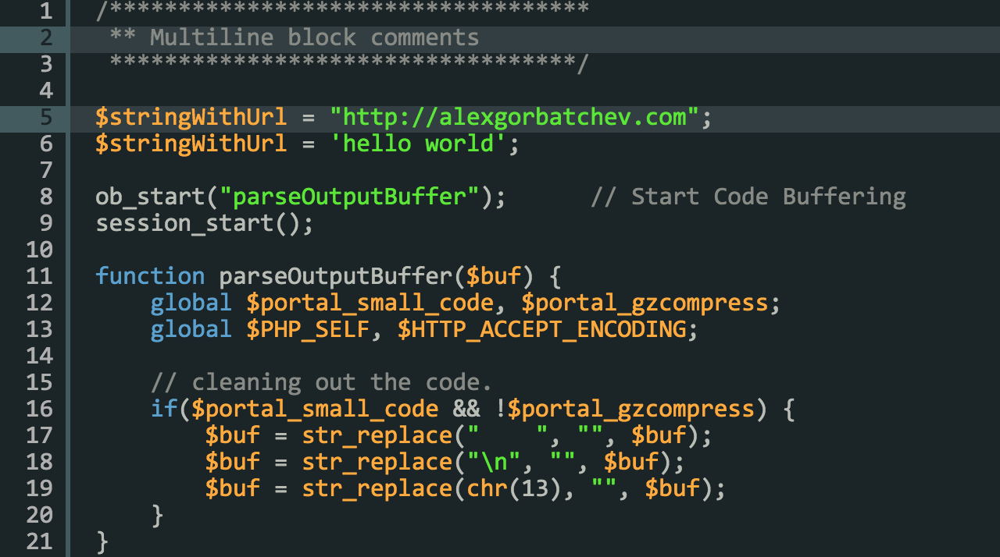

# theme-rdark

[](https://gratipay.com/alexgorbatchev/)
[](https://travis-ci.org/syntaxhighlighter/theme-rdark)


RDark theme for [SyntaxHighlighter](https://github.com/syntaxhighlighter/syntaxhighlighter).



## Installation

```
npm install theme-rdark
```

## Usage

Please see [SyntaxHighlighter](https://github.com/syntaxhighlighter/syntaxhighlighter) for usage instructions.

## Testing

```
npm test
```

## License

MIT
